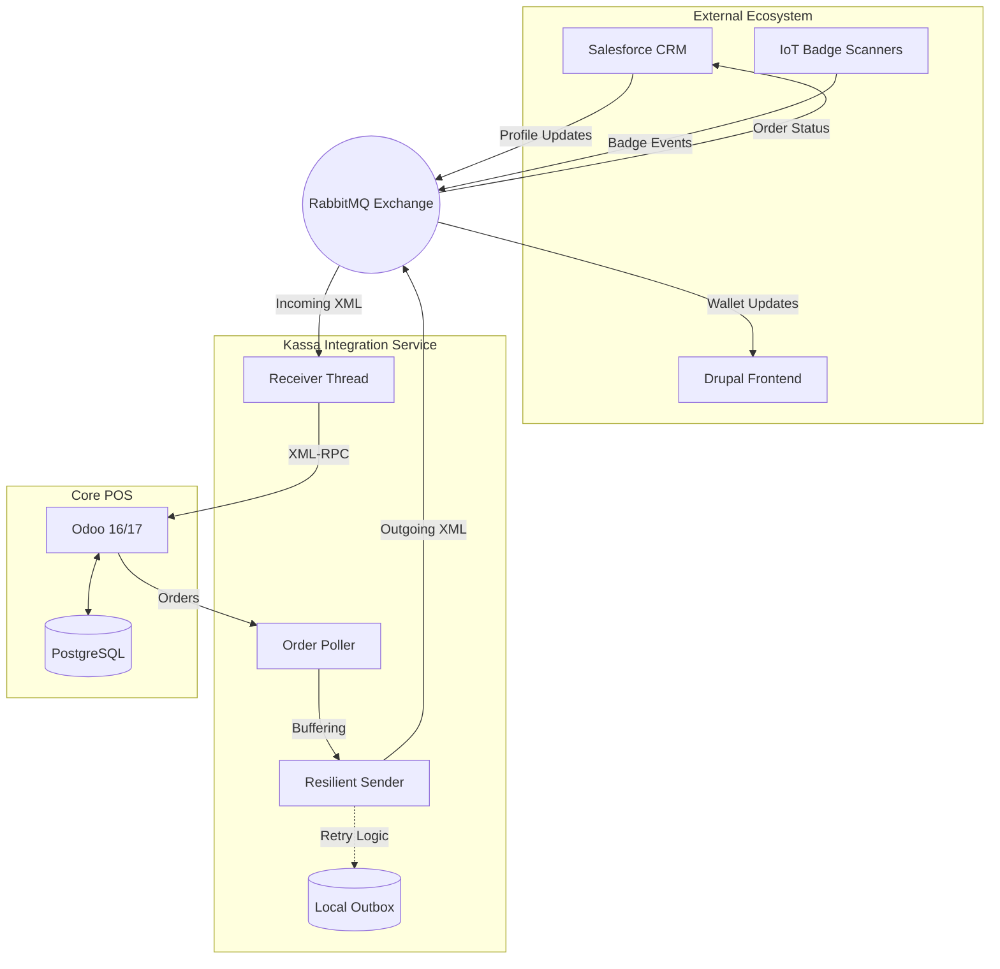

<div align="center">
  

  # Kassa (POS Integration)
  
  **A high-performance, resilient integration bridge between Odoo POS and RabbitMQ ecosystem.**

  [](https://www.python.org/)
  [](https://www.odoo.com/)
  [](https://www.rabbitmq.com/)
  [](https://www.postgresql.org/)
  [](https://www.docker.com/)
</div>

---

## 📖 Overview

The **Kassa Integration** project serves as the central nervous system for Team POS at Desideriushogeschool 2026. It facilitates seamless, asynchronous communication between Odoo 16/17 and external entities like CRM (Salesforce), Frontend (Drupal), and IoT Badge Scanners.

Built with a focus on **offline resilience** and **event-driven architecture**, this system ensures that retail operations continue uninterrupted even during network instability, buffering critical transaction data for later synchronization.

---

## 📋 Table of Contents

- [✨ Features](#-features)
- [🏗️ Architecture](#-architecture)
- [🚀 Getting Started](#-getting-started)
- [💻 Usage](#-usage)
- [📁 Repository Structure](#-repository-structure)
- [🤝 Contributing](#-contributing)
- [📜 License](#-license)

---

## ✨ Features

- **🛡️ Offline Resilience**: Integrated `outbox.json` buffering system ensures no message is ever lost when RabbitMQ is unreachable.
- **🆔 Badge Integration**: Automated customer selection and badge scanning through Odoo's `bus` service.
- **🔞 Compliance Checks**: Automated age restriction pop-ups (e.g., for alcohol) directly in the POS frontend.
- **🔄 Bidirectional Sync**: 
  - **Receiver**: Real-time customer profile updates from CRM.
  - **Poller**: Automated extraction of POS orders for external reporting.
- **✅ Message Validation**: Strict XSD schema validation for all incoming and outgoing XML messages.

---

## 🏗️ Architecture

The integration leverages a modular Python service that interfaces with Odoo via XML-RPC and connects to the broader ecosystem through a dedicated RabbitMQ exchange.



---

## 🚀 Getting Started

### Prerequisites

- **Docker & Docker Compose**
- **Python 3.12+** (for local development/testing)
- **Git**

### Installation

1. **Clone the repository**:
   ```bash
   git clone https://github.com/JeremyLuyckfasseel/Kassa.git
   cd Kassa
   ```

2. **Configure Environment**:
   ```bash
   cp .env.example .env
   # Edit .env with your local Odoo and RabbitMQ credentials
   ```

3. **Launch the stack**:
   ```bash
   docker-compose up -d
   ```

---

## 💻 Usage

### Connection Diagnostic
Validate that the integration service can authenticate with Odoo:
```bash
docker-compose exec kassa-integratie python tools/ping_odoo.py
```

### Manual Buffer Flush
If messages are stored in the outbox due to connection issues, trigger a manual flush:
```bash
docker-compose exec kassa-integratie python -c "import sender; sender.flush_buffer()"
```

### Testing the Flow
Simulate an incoming badge scan or order creation using the built-in tools:
```bash
docker-compose exec kassa-integratie python tools/create_test_order.py
```

---

## 📁 Repository Structure

```text
📦 Kassa
 ┣ 📂 addons/                # Custom Odoo modules (kassa_pos_custom)
 ┣ 📂 integratie/            # Python integration service
 ┃ ┣ 📂 schemas/             # XML XSD validation schemas
 ┃ ┣ 📂 tests/               # Unit and Integration tests
 ┃ ┣ 📂 tools/               # Diagnostic and utility scripts
 ┃ ┣ 📜 main.py              # Service entrypoint
 ┃ ┣ 📜 receiver.py          # RabbitMQ message consumer
 ┃ ┣ 📜 sender.py            # Resilient message publisher
 ┃ ┗ 📜 order_poller.py      # Odoo order monitor
 ┣ 📂 k8s/                   # Kubernetes deployment manifests
 ┣ 📜 docker-compose.yml     # Local orchestration
 ┗ 📜 README.md              # You are here!
```

---

## 🤝 Contributing

We welcome contributions from the team! 

1. Create a `feature/` or `fix/` branch.
2. Ensure all tests pass: `pytest integratie/tests/`.
3. Submit a Pull Request for review.

---

## 📜 License

This project is licensed under the **LGPL-3** License. See the [addons/kassa_pos_custom/__manifest__.py](addons/kassa_pos_custom/__manifest__.py) for details.

---

<div align="center">
  Built with ❤️ by Team POS - Integration Project 2026
</div>
