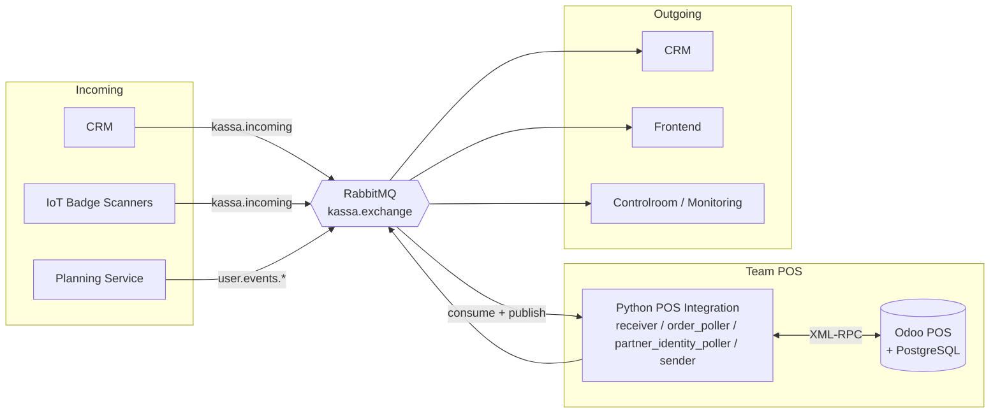

<div align="center">


<br>


<br>

> **Official repository of Team POS (Kassa) — Integration Project Desideriushogeschool 2026**
>
> *An event-driven POS integration layer on top of Odoo POS, exchanging XML messages with external systems through RabbitMQ.*

<br>

</div>

<br>

<a id="table-of-contents"></a>


<br>

- [System Architecture](#system-architecture)
- [Message Flows & Routing](#message-flows--routing)
- [Documentation & Data Mapping](#documentation--data-mapping)
- [Local Development & Setup](#local-development--setup)
- [Repository Structure](#repository-structure)
- [CI/CD & Deployment](#cicd--deployment)
- [Team](#team)

<br>
<br>

<a id="system-architecture"></a>


<br>



The integration service communicates with Odoo only via **XML-RPC**, validates XML against **XSD contracts**, and uses RabbitMQ topic routing for all cross-system messaging.

<br>

<details open>
<summary><b>Core Design Principles</b></summary>
<br>

| Principle | Description |
| :--- | :--- |
| **Message Broker First** | External systems communicate through RabbitMQ exchanges/queues; no direct system-to-system coupling. |
| **Strict XML Contracts** | Incoming and outgoing XML is validated against schemas in `integratie/schemas/`. |
| **Offline Buffering** | If RabbitMQ is unavailable, outbound messages are buffered in `outbox/outbox.json` (max 500) and replayed by `flush_buffer()`. |
| **Idempotent Processing** | Receiver keeps a bounded in-memory duplicate cache (10,000 message IDs) to avoid reprocessing duplicates. |
| **Safe Failure Handling** | Invalid/unknown messages are rejected (`nack`, `requeue=false`) and emitted as `system_error` events for observability. |

</details>

<br>
<br>

<a id="message-flows--routing"></a>


<br>

<details open>
<summary><b>Incoming — <code>kassa.incoming</code></b></summary>
<br>

| Type | Source | Action |
| :--- | :--- | :--- |
| `new_registration` | CRM | Create/update customer in Odoo |
| `profile_update` | CRM | Update existing customer profile in Odoo |
| `badge_scanned` | IoT / POS | Resolve customer + trigger wallet lease lifecycle |
| `cancel_registration` | CRM | Deactivate customer (`active=False`) |
| `wallet_lease_grant` | CRM | Confirm lease + synchronize wallet authority/balance |
| `wallet_remote_topup` | CRM | Apply remote top-up to active lease/customer |
| `event_ended` | CRM/Planning | Trigger delayed return of active leases |

</details>

<br>

<details open>
<summary><b>Optional Subscription — <code>user.events.*</code> fanout</b></summary>
<br>

When `SUBSCRIBE_USER_EVENTS=true`, the receiver subscribes to planning/identity `user.events.*` notifications and validates them with `schema_user_event.xsd` (informational flow, no direct Odoo write).

</details>

<br>

<details open>
<summary><b>Outgoing — <code>kassa.exchange</code> and related exchanges</b></summary>
<br>

| Message Type | Routing Key | Primary Destination |
| :--- | :--- | :--- |
| `consumption_order` | `kassa.payments.consumption` | CRM |
| `payment_registered_consumption` | `kassa.payments.consumption` | CRM |
| `payment_registered_registration` | `kassa.payments.registration` | CRM |
| `invoice_request` | `kassa.payments.invoice` | CRM |
| `badge_assigned` | `kassa.payments.badge` | CRM |
| `refund_processed` | `kassa.payments.refund` | CRM |
| `payment_status` | `kassa.frontend.payment` | Frontend |
| `wallet_balance_update` | `kassa.frontend.wallet` | Frontend |
| `wallet_lease_request` | `kassa.to.crm.wallet_lease_request` | CRM |
| `wallet_lease_return` | `kassa.to.crm.wallet_lease_return` | CRM |
| `user_sessions_request` | `kassa.to.planning.user_sessions_request` | Planning |
| `system_error` | `kassa.errors` | Monitoring / Error Queue |
| `log` | `logs` | Monitoring |

</details>

> Teams can observe all Kassa topics with wildcard bindings such as `kassa.#` where permitted by broker policy.

<br>
<br>

<a id="documentation--data-mapping"></a>


<br>

Architecture, flows, and XML contracts are documented in `documentatie/` *(Dutch)*:

<br>

| File | Contents |
| :--- | :--- |
| [Technische_Gids_Kassa.md](documentatie/Technische_Gids_Kassa.md) | End-to-end architecture, setup, flows, operations |
| [Tech_Stack_Kassa.md](documentatie/Tech_Stack_Kassa.md) | Stack choices, dependencies, environment settings |
| [XML_Structuren_Kassa.md](documentatie/XML_Structuren_Kassa.md) | XML examples and schema usage |
| [XML_XSD_Contract_v2.3_Centralized.md](documentatie/XML_XSD_Contract_v2.3_Centralized.md) | Canonical centralized XSD message contract |
| [Datamapping_Kassa.md](documentatie/Datamapping_Kassa.md) | Odoo ↔ XML field mapping by flow |
| [Identity_Integration.md](documentatie/Identity_Integration.md) | Identity-service integration and lifecycle |
| [User_Stories_Kassa.md](documentatie/User_Stories_Kassa.md) | User stories, acceptance criteria, DoD |
| [Vragen_Kassa.md](documentatie/Vragen_Kassa.md) | Decision log and open/answered questions |

<br>
<br>

<a id="local-development--setup"></a>


<br>

### Prerequisites


### Quickstart

**1. Configure environment**
```bash
cp .env.example .env
# Fill in credentials in .env
```

**2. Start full stack**
```bash
docker-compose up -d
```

**3. Validate Odoo connectivity**
```bash
docker-compose exec kassa-integratie python tools/ping_odoo.py
```

**4. Run local Python checks (outside Docker)**
```bash
pip install -r integratie/requirements.txt
pip install -r integratie/requirements-dev.txt
flake8 integratie/ --max-line-length=120
mypy --config-file=mypy.ini -p integratie
pytest integratie/tests/ -v
```

<br>

### Useful Commands

| Command | What it does |
| :--- | :--- |
| `docker-compose up -d` | Start all containers in background |
| `docker-compose down` | Stop and remove all containers |
| `docker-compose logs -f kassa-integratie` | Follow integration service logs |
| `docker-compose logs -f kassa-web` | Follow Odoo logs |
| `docker-compose exec kassa-integratie python tools/run_integration_tests.py` | Run containerized integration smoke tests |
| `docker-compose exec kassa-integratie python tools/create_test_order.py` | Create test order in Odoo |
| `docker-compose exec kassa-integratie python -c "import sender; sender.flush_buffer()"` | Manually flush buffered outbox messages |

<br>

> [!WARNING]
> **Known Pitfall — Odoo webassets 500 after restart**
>
> If Odoo POS throws a `500` on `/web/assets/...` after restart, run:
> ```bash
> docker exec -i kassa_db psql -U odoo -d odoo_kassa -c "DELETE FROM ir_attachment WHERE url LIKE '/web/assets/%';"
> docker-compose restart kassa-web
> ```

<br>
<br>

<a id="repository-structure"></a>


<br>

```text
📦 Kassa/
 ┣ 📂 addons/                     # Custom Odoo add-ons
 ┣ 📂 documentatie/               # Functional/technical docs and contracts
 ┣ 📂 integratie/                 # Python integration service
 ┃ ┣ 📂 schemas/                  # XSD schemas for all supported XML types
 ┃ ┣ 📂 tests/                    # Pytest suite
 ┃ ┣ 📂 tools/                    # Diagnostics and helper scripts
 ┃ ┣ 📄 main.py                   # Service entrypoint
 ┃ ┣ 📄 receiver.py               # RabbitMQ consumer + incoming flow handlers
 ┃ ┣ 📄 order_poller.py           # Polls paid/done Odoo POS orders
 ┃ ┣ 📄 partner_identity_poller.py # Links Odoo partners with identity UUIDs
 ┃ ┣ 📄 sender.py                 # Outgoing XML builders + RabbitMQ publishing + outbox
 ┃ ┗ 📄 odoo_setup.py             # Idempotent Odoo bootstrap/configuration
 ┣ 📂 tools/                      # Top-level helper scripts
 ┣ 📄 docker-compose.yml          # Local Odoo + Postgres + RabbitMQ + integration stack
 ┣ 📄 .env.example                # Environment template
 ┗ 📄 README.md
```

<br>
<br>

<a id="cicd--deployment"></a>


<br>

GitHub Actions workflows in this repository:

| Workflow | Triggers | Main Actions |
| :--- | :--- | :--- |
| `ci.yml` (CI Pipeline) | Push + PR on `main`, `dev`, `prod` (plus `v*` tags for push) | Flake8, mypy, pytest, Docker Compose integration tests, identity RPC integration tests |
| `deploy.yml` (Deploy Pipeline) | Push to `dev`, manual dispatch, and successful CI workflow-run for versioned heads | Build and push Docker images to GHCR (`latest`, env tag, commit SHA) |
| `security.yml` (Security Scanning) | Push + PR on `main/dev/prod`, weekly cron | Bandit, pip-audit, TruffleHog, Trivy |

### Branch Strategy

| Branch | Purpose |
| :--- | :--- |
| `main` | Stable production branch |
| `dev` | Active development and integration |
| `prod` | Protected release/testing branch |
| `feature/...` | Feature branches |
| `fix/...` | Bugfix branches |

<br>
<br>

<a id="team"></a>


<br>

<div align="center">
<table>
  <tr>
    <td align="center" width="240">
      <a href="https://github.com/Jeremy-Luyckfasseel">
        
      </a>
      <br/><br/>
      <a href="https://github.com/Jeremy-Luyckfasseel"><b>Jeremy Luyckfasseel</b></a>
      <br/><br/>
      
    </td>
    <td width="40"></td>
    <td align="center" width="240">
      <a href="https://github.com/Ahmeedddddd">
        
      </a>
      <br/><br/>
      <a href="https://github.com/Ahmeedddddd"><b>Ahmed Takadoumi</b></a>
      <br/><br/>
      
    </td>
    <td width="40"></td>
    <td align="center" width="240">
      <a href="https://github.com/zenoemvn">
        
      </a>
      <br/><br/>
      <a href="https://github.com/zenoemvn"><b>Zeno Van Neygen</b></a>
      <br/><br/>
      
    </td>
  </tr>
</table>
</div>

<br>
<br>

<div align="center">


</div>
