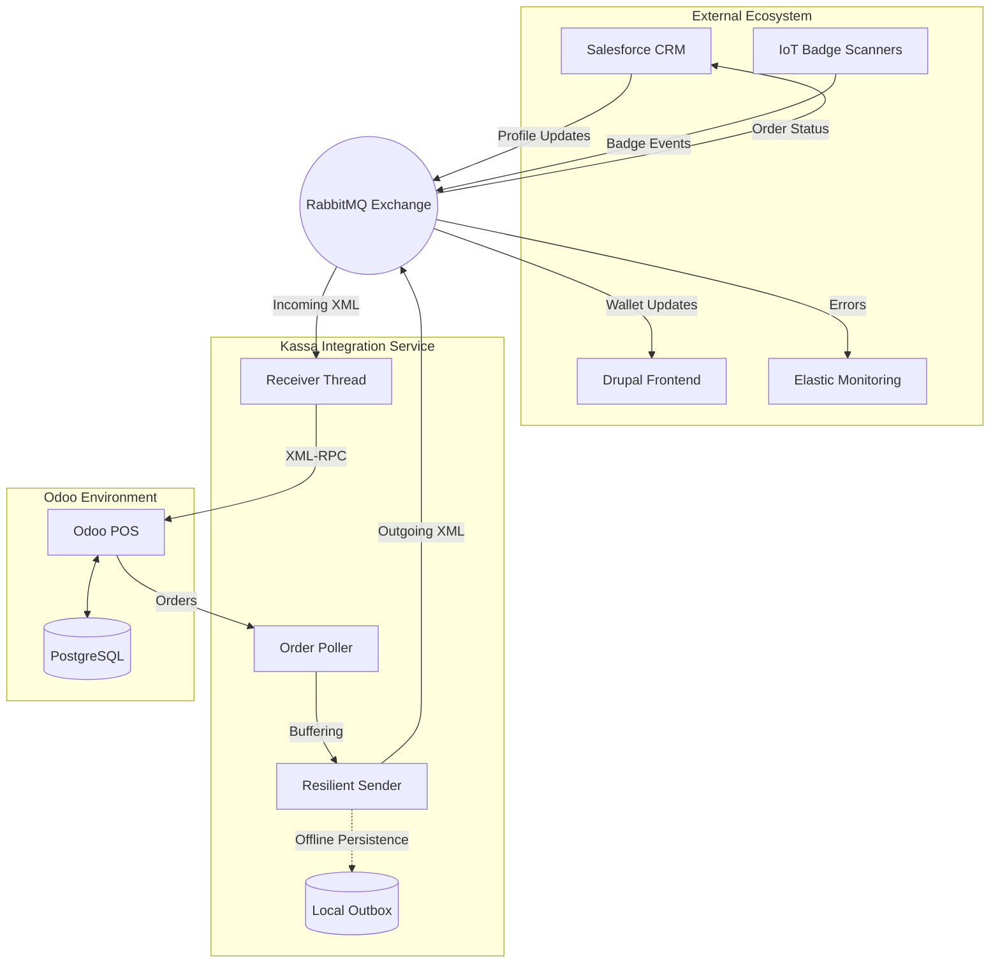

<div align="center">

<!-- Typing SVG Header - TEAM FOCUSED -->


<br/>

<!-- Status & Tech Badges -->
[](https://github.com/IntegrationProject-Groep1/Kassa)
[](https://github.com/IntegrationProject-Groep1/Kassa/actions)
[](https://github.com/IntegrationProject-Groep1/Kassa/blob/dev/addons/kassa_pos_custom/__manifest__.py)
[](https://www.odoo.com)
[](https://www.rabbitmq.com)

<br/>

<!-- Skill Icons Grid - PROJECT RELEVANT -->
<a href="https://skillicons.dev">
  
</a>

</div>

---

## Overview

The **Kassa Integration** is the core communication layer for Team POS at Desideriushogeschool 2026. It manages the flow of data between the **Odoo Point of Sale** and external enterprise systems (Salesforce, Drupal, IoT) using a resilient, event-driven architecture.

---

## Core Capabilities

- **Resilience**: Local `outbox.json` buffering ensures 100% message delivery during network outages.
- **Smart Identity**: IoT Badge scanning via Odoo `bus` for instantaneous customer identification in the POS UI.
- **Compliance**: Automated logic for age-restricted products and anonymous transaction blocking.
- **Sync Engine**: High-frequency polling and real-time consumption order dispatching via RabbitMQ.

---

## System Architecture

The integration service acts as a decoupled orchestrator between Odoo's synchronous API and the ecosystem's asynchronous messaging.



### Message Routing Details

| Message Type | Direction | Routing Key | Purpose |
| :--- | :---: | :--- | :--- |
| `new_registration` | 📥 | `kassa.incoming` | Sync new customers from CRM to Odoo. |
| `badge_scanned` | 📥 | `kassa.incoming` | Trigger UI profile load via Odoo bus. |
| `consumption_order`| 📤 | `kassa.payments.consumption` | Finalize transaction billing in Salesforce. |
| `system_error` | 📤 | `kassa.errors` | Real-time observability in Elastic. |

---

## Repository Structure

```text
📦 Kassa
 ┣ 📂 addons/                # Custom Odoo modules (badge scanning, age restrictions)
 ┣ 📂 integratie/            # Python integration service
 ┃ ┣ 📂 schemas/             # XML XSD validation schemas
 ┃ ┣ 📂 tests/               # Pytest suites
 ┃ ┣ 📂 tools/               # Diagnostic and simulation scripts
 ┃ ┣ 📜 main.py              # Service entrypoint
 ┃ ┣ 📜 receiver.py          # RabbitMQ message consumer
 ┃ ┣ 📜 sender.py            # Resilient message publisher
 ┃ ┗ 📜 order_poller.py      # Odoo order monitor
 ┣ 📂 k8s/                   # Kubernetes deployment manifests
 ┣ 📜 docker-compose.yml     # Local orchestration stack
 ┗ 📜 README.md
```

---

## Getting Started

### Prerequisites
- Docker & Docker Compose
- Python 3.12+ (for local testing)

### Launch Stack
```bash
cp .env.example .env
docker-compose up -d
```

### Connectivity Check
Validate the XML-RPC connection to Odoo:
```bash
docker-compose exec kassa-integratie python tools/ping_odoo.py
```

---

## Team

| Role | Name |
| :--- | :--- |
| **Team Lead** | Jeremy Luyckfasseel |
| **Developer** | Ahmed Takadoumi |
| **Developer** | Zeno Van Neygen |

---

<div align="center">
  Official Repository - Team POS Integration Project 2026
</div>
