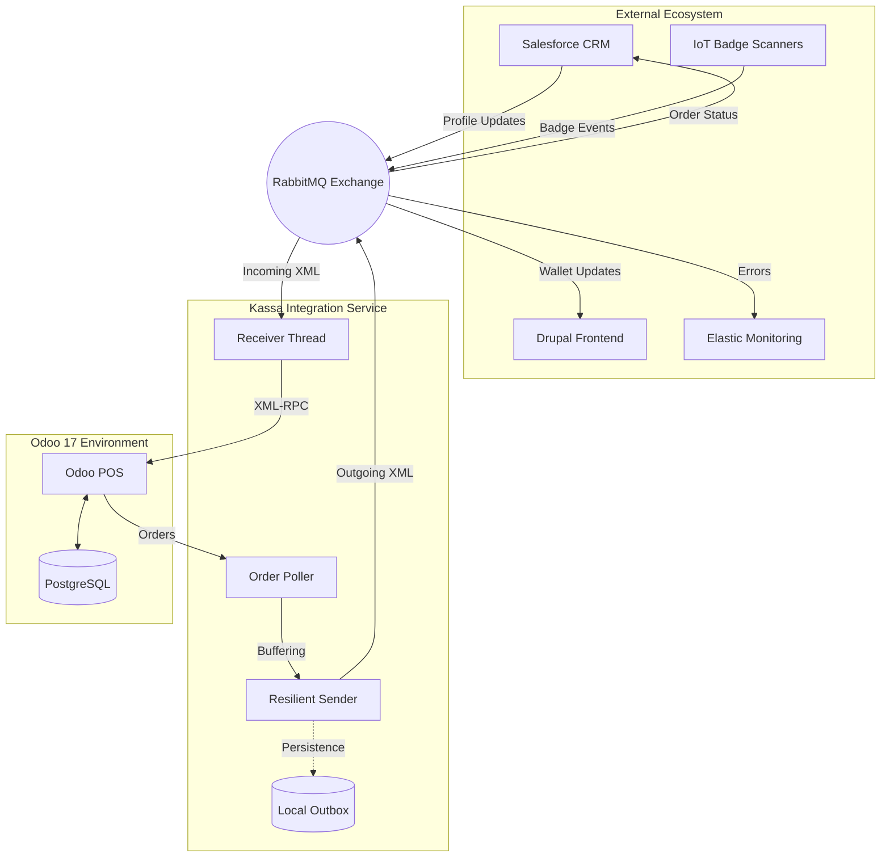

<div align="center">
  

  <!-- Tech Badges -->
  
  
  
  
  

  <br/>

  <!-- CI/CD & Project Stats -->
  [](https://github.com/IntegrationProject-Groep1/Kassa/actions/workflows/ci.yml)
  [](https://github.com/IntegrationProject-Groep1/Kassa/actions/workflows/security.yml)
  

  <br/>

  <!-- Skill Icons Grid -->
  <a href="https://skillicons.dev">
    
  </a>
</div>

---

## Overview

The **Kassa Integration** is the mission-critical communication bridge for Team POS at Desideriushogeschool 2026. It orchestrates high-integrity data flows between **Odoo 17** and external enterprise platforms including Salesforce CRM, Drupal, and IoT infrastructure.

Built on an event-driven architecture, it guarantees **100% message durability** through a sophisticated local buffering system, ensuring that retail operations never stop, even during network instability.

---

## 📊 Project Health

<p align="center">
  
  
  
</p>

---

## Core Capabilities & Resilience

### Offline-First Design
The integration service is built to handle RabbitMQ unavailability. Outgoing messages are automatically routed through the `sender.py` resilient publisher:
- **Persistent Buffering**: If the broker is unreachable, messages are stored in `outbox/outbox.json` (mounted as a Docker volume).
- **Ordered Replay**: The `flush_buffer()` mechanism ensures messages are re-delivered in the exact order they were created once connectivity is restored.

### Technical Highlights
- **IoT Badge Integration**: Uses Odoo 17's `bus` service to push real-time customer data to the POS UI upon physical badge scans.
- **Compliance Engine**: Automated logic for age-restricted products and validation of anonymous wallet transactions.
- **Idempotency**: A FIFO bounded cache (10,000 entries) in `receiver.py` prevents duplicate message processing.

---

<p align="center">
  
</p>

The service acts as a decoupled orchestrator, managing state between Odoo's synchronous XML-RPC API and the asynchronous RabbitMQ bus.



### 📋 Message Routing Matrix

| Message Type | Direction | Routing Key | Purpose |
| :--- | :--- | :--- | :--- |
| `new_registration` | **Incoming** | `kassa.incoming` | Sync new customer profiles from CRM. |
| `profile_update` | **Incoming** | `kassa.incoming` | Update existing customer details in Odoo. |
| `badge_scanned` | **Incoming** | `kassa.incoming` | Trigger real-time UI profile loading. |
| `cancel_registration`| **Incoming** | `kassa.incoming` | Deactivate customer profiles (soft delete). |
| `consumption_order` | **Outgoing** | `kassa.payments.consumption` | Sync transaction data with Salesforce. |
| `payment_registered` | **Outgoing** | `kassa.payments.*` | Confirm payments (Consumption/Registration). |
| `invoice_request` | **Outgoing** | `kassa.payments.invoice` | Request invoice generation in Salesforce. |
| `badge_assigned` | **Outgoing** | `kassa.payments.badge` | Link new badge to customer in Salesforce. |
| `refund_processed` | **Outgoing** | `kassa.payments.refund` | Sync refunds with Salesforce. |
| `payment_status` | **Outgoing** | `kassa.frontend.payment` | Update Drupal transaction status. |
| `wallet_balance_update`| **Outgoing** | `kassa.frontend.wallet` | Push wallet changes to Drupal. |
| `heartbeat` | **Outgoing** | `kassa.heartbeat` | System health pulse. |
| `system_error` | **Outgoing** | `kassa.errors` | Log failures to Elastic/Monitoring. |

---

## CI/CD & Quality Assurance

The project employs a robust multi-stage GitHub Actions pipeline:

### CI Pipeline (`ci.yml`)
Runs on every push/PR to `main`, `dev`, or `prod`:
- **Linting**: Flake8 enforcement (max-length 120).
- **Static Analysis**: MyPy type checking across the integration suite.
- **Testing**: Exhaustive Pytest suite covering receivers, senders, and order polling logic.

### Security Scanning (`security.yml`)
- **SAST**: Bandit scans for Python-specific security vulnerabilities.
- **Secrets**: TruffleHog scans the entire history for leaked credentials.
- **Containers**: Trivy vulnerability scanning of the filesystem and dependencies.

---

## 📚 Project Documentation

Detailed technical and functional documentation can be found in the `documentatie/` directory:

| Document | Description |
| :--- | :--- |
| [Technische Gids](documentatie/Technische_Gids_Kassa.md) | Full setup, architecture details, and script explanations. |
| [Datamapping](documentatie/Datamapping_Kassa.md) | Odoo-to-XML field mappings and enum definitions. |
| [XML Structuren](documentatie/XML_Structuren_Kassa.md) | Exhaustive examples of all message formats. |
| [User Stories](documentatie/User_Stories_Kassa.md) | BDD scenarios and acceptance criteria for all features. |
| [Decisions (Vragen)](documentatie/Vragen_Kassa.md) | Architectural decision log and technical Q&A. |

---

## Repository Structure

```text
📦 Kassa
 ┣ 📂 .github/workflows      # CI, Deploy, and Security pipelines
 ┣ 📂 addons/                # Custom Odoo 17 modules (badge scanning, UI logic)
 ┣ 📂 documentatie/          # Technical and functional documentation
 ┣ 📂 integratie/            # Python integration service
 ┃ ┣ 📂 schemas/             # XML XSD validation schemas (14 types)
 ┃ ┣ 📂 tests/               # Pytest integration/unit suites
 ┃ ┣ 📂 tools/               # Integration-specific diagnostic tools
 ┃ ┣ 📜 main.py              # Orchestration entrypoint
 ┃ ┣ 📜 receiver.py          # RabbitMQ consumer (idempotent)
 ┃ ┣ 📜 sender.py            # Resilient publisher (buffered)
 ┃ ┗ 📜 order_poller.py      # Odoo 17 order extraction
 ┣ 📂 outbox/                # Local buffer persistence (Docker volume)
 ┣ 📂 tools/                 # Root utility and diagnostic scripts
 ┣ 📜 docker-compose.yml     # Local dev orchestration stack
 ┣ 📜 Dockerfile             # Integration service container definition
 ┗ 📜 README.md
```

---

## Getting Started

### 1. Prerequisites
- **Docker & Docker Compose**
- **Python 3.12+** (optional, for local development)

### 2. Rapid Launch (Docker)
The integration service automatically bootstraps the Odoo database, installs required modules, and configures custom fields on startup.

```bash
cp .env.example .env
# Edit .env and set ODOO_MASTER_PASS and other credentials
docker-compose up -d
```

- **Odoo POS**: [http://localhost:8069](http://localhost:8069)

### 3. Local Python Setup (Development)
If you wish to run the integration scripts or tests outside of Docker:
```bash
python -m venv .venv
source .venv/bin/activate  # Or .venv\Scripts\activate on Windows
pip install -r integratie/requirements.txt
```

### 4. Diagnostics & Verification
```bash
# Verify XML-RPC connectivity to Odoo
docker-compose exec kassa-integratie python tools/ping_odoo.py

# Run full test suite
docker-compose exec kassa-integratie pytest integratie/tests/
```

---

<div align="center">

<p align="center">
  
</p>

<br/>

<p align="center">
  <a href="https://github.com/Jeremy-Luyckfasseel">
    
  </a>
</p>
<p align="center">
  <a href="https://github.com/AhmedTakadoumi">
    
  </a>
  &nbsp;&nbsp;
  <a href="https://github.com/zenovn">
    
  </a>
</p>

<br/>

*"Turning complex business requirements into seamless technical solutions."*

<br/>

**Official Repository - Integration Project Desideriushogeschool 2026**

</div>
