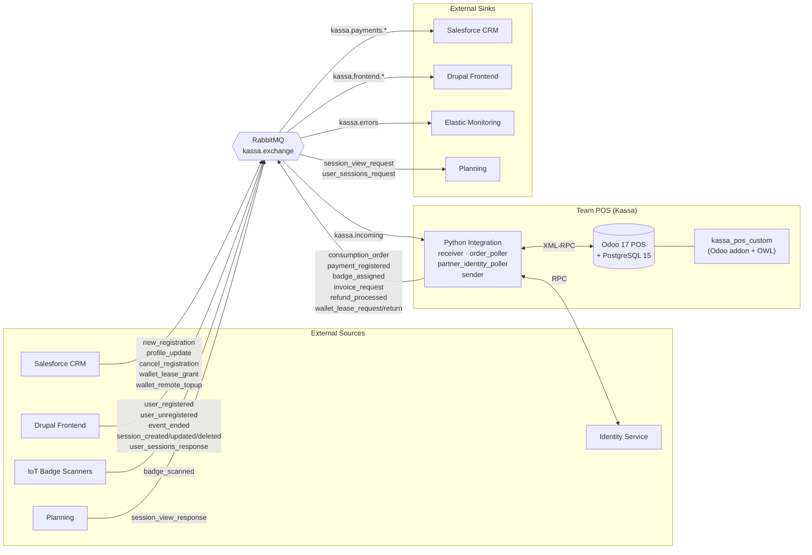

<div align="center">


<br>


<br>

> **Official repository of Team POS (Kassa) — Integration Project Desideriushogeschool 2026**
>
> *A generic, reusable event-driven Point of Sale system built on Odoo POS, communicating asynchronously with Salesforce CRM, Drupal Frontend, Planning, Identity Service, Elastic, and IoT Badge Scanners via RabbitMQ.*

<br>

</div>

<br>

<a id="table-of-contents"></a>


<br>

- [System Architecture](#system-architecture)
- [Message Flows & Routing](#message-flows--routing)
- [Documentation & Data Mapping](#documentation--data-mapping)
- [Local Development & Setup](#local-development--setup)
- [Repository Structure](#repository-structure)
- [CI/CD & Deployment](#cicd--deployment)
- [Team](#team)

<br>
<br>

<a id="system-architecture"></a>


<br>



The Python integration service communicates with Odoo exclusively via the built-in **XML-RPC API**. All inter-system communication is asynchronous, via structured **XML messages over RabbitMQ** (`kassa.exchange`, topic exchange). The `kassa_pos_custom` Odoo addon extends the POS UI with OWL components for QR scanning, real-time partner updates via the Odoo bus, and payment guards.

<br>

<details open>
<summary><b>Core Design Principles</b></summary>
<br>

| Principle | Description |
| :--- | :--- |
| **Loosely Coupled** | Systems never talk directly — everything flows through `kassa.exchange` (topic exchange) |
| **Offline-first Buffering** | If RabbitMQ is down, messages queue in `outbox.json` (Docker volume `outbox-data`) and auto-retry via `flush_buffer()`. The POS continues selling. |
| **Local Odoo Cache** | When the CRM is unreachable, the POS operates on locally cached customer profiles. Syncs on reconnect. |
| **Error Handling** | Invalid messages are caught as `system_error`, routed to `kassa.errors`, and rejected with `basic_nack(requeue=false)` into the Dead Letter Queue. |
| **Heartbeats** | Managed by a dedicated monitoring sidecar container — not by the POS integration itself. |

</details>

<br>
<br>

<a id="message-flows--routing"></a>


<br>

<details open>
<summary><b>Incoming — <code>kassa.incoming</code> &amp; Frontend exchange</b></summary>
<br>

| Type | From | Action |
| :--- | :--- | :--- |
| `new_registration` | CRM | Create or update customer profile; set `customer_rank=1` for POS visibility |
| `profile_update` | CRM | Update customer profile fields in Odoo |
| `cancel_registration` | CRM | Deactivate customer profile (`active=False`) |
| `badge_scanned` | IoT / Frontend (QR) | Look up by `x_badge_id` or `identity_uuid`; start wallet lease |
| `wallet_lease_grant` | CRM | Reconcile `x_wallet_balance`; store `x_lease_id`; publish `wallet_balance_update` |
| `wallet_remote_topup` | CRM | Add balance to active lease; park in `x_pending_topup_balance` if grant pending |
| `event_ended` | Frontend | Return all active wallet leases to CRM via `wallet_lease_return` |
| `user_registered` | Frontend (dual-publish) | Add session to `x_session_title`; update `x_outstanding_amount` additively |
| `user_unregistered` | Frontend (dual-publish) | Remove session; subtract price from `x_outstanding_amount` |
| `user_sessions_response` | Frontend | Create/update POS session products per visitor |
| `session_created` | Frontend | Create new POS product for session |
| `session_updated` | Frontend | Update existing session POS product (name/price) |
| `session_deleted` | Frontend | Log and ack — product kept for ongoing transactions |
| `session_view_response` | Planning | Bulk-upsert full session catalogue into Odoo POS |
| `user_event` | user.events fanout | Informational only — no Odoo action |

</details>

<br>

<details open>
<summary><b>Outgoing — <code>kassa.exchange</code></b></summary>
<br>

| Type | Routing Key | Destination |
| :--- | :--- | :--- |
| `consumption_order` | `kassa.payments.consumption` | Salesforce CRM |
| `payment_registered` | `kassa.payments.consumption` / `kassa.payments.registration` | Salesforce CRM |
| `invoice_request` | `kassa.payments.invoice` | Salesforce CRM |
| `badge_assigned` | `kassa.payments.badge` | Salesforce CRM |
| `refund_processed` | `kassa.payments.refund` | Salesforce CRM |
| `wallet_lease_request` | `kassa.wallet.lease.request` | Salesforce CRM |
| `wallet_lease_return` | `kassa.wallet.lease.return` | Salesforce CRM |
| `payment_status` | `kassa.frontend.payment` | Drupal Frontend |
| `wallet_balance_update` | `kassa.frontend.wallet` | Drupal Frontend |
| `user_sessions_request` | `kassa.to.frontend.user_sessions_request` | Drupal Frontend |
| `session_view_request` | via `planning.exchange` | Planning |
| `system_error` | `kassa.errors` | Elastic |

</details>

> The Controlroom team can passively monitor **all** POS messages via the wildcard binding `kassa.#`.

<br>
<br>

<a id="documentation--data-mapping"></a>


<br>

All architecture, data flows, and XML standards live in the `documentatie/` directory *(written in Dutch)*:

<br>

| File | Contents |
| :--- | :--- |
| [Technische_Gids_Kassa.md](documentatie/Technische_Gids_Kassa.md) | Full architecture, all modules explained, Docker setup, wallet lease lifecycle |
| [Tech_Stack_Kassa.md](documentatie/Tech_Stack_Kassa.md) | Technologies, Python libraries, environment variables, architecture constraints |
| [XML_XSD_Contract_v2.3_Centralized.md](documentatie/XML_XSD_Contract_v2.3_Centralized.md) | **Authoritative** XML/XSD contract — all message types, schemas, enums |
| [XML_Structuren_Kassa.md](documentatie/XML_Structuren_Kassa.md) | XML examples and XSD schema references per flow |
| [Datamapping_Kassa.md](documentatie/Datamapping_Kassa.md) | Field mapping from Odoo to XML per message type, enum values |
| [Identity_Integration.md](documentatie/Identity_Integration.md) | Identity Service RPC format, routing keys, PartnerIdentityPoller flow |
| [User_Stories_Kassa.md](documentatie/User_Stories_Kassa.md) | MVP features, BDD scenarios, acceptance criteria, Definition of Done |
| [Vragen_Kassa.md](documentatie/Vragen_Kassa.md) | Decision log — all technical and functional choices explained |

<br>
<br>

<a id="local-development--setup"></a>


<br>

### Prerequisites


### Quickstart

**1. Configure Environment**
```bash
cp .env.example .env
# Fill in credentials in .env
```

**2. Start the full stack**
```bash
docker-compose up -d
```

**3. Validate the XML-RPC connection to Odoo**
```bash
docker-compose exec kassa-integratie python tools/ping_odoo.py
```
> *Expected:* `Authenticatie geslaagd! Scripts kunnen data veilig wegschrijven.`

<br>

### Useful Commands

| Command | What it does |
| :--- | :--- |
| `docker-compose up -d` | Start all containers in the background |
| `docker-compose down` | Stop and remove all containers |
| `docker-compose logs -f kassa-integratie` | Live logs from the integration container |
| `docker-compose logs -f odoo` | Live logs from Odoo |
| `docker-compose exec kassa-integratie bash` | Open a shell in the integration container |

### Run Scripts

```bash
docker-compose exec kassa-integratie python integratie/tools/test_sender.py
```

<br>

> [!WARNING]
> **Known Pitfall — Odoo webassets 500 after restart**
>
> If Odoo POS throws a `500` error on `/web/assets/...` after a container restart, run:
> ```bash
> docker exec -i kassa_db psql -U odoo -d odoo_kassa -c "DELETE FROM ir_attachment WHERE url LIKE '/web/assets/%';"
> docker-compose restart kassa-web
> ```
> See §3.2.1 of the Technical Guide for a full explanation.

<br>
<br>

<a id="repository-structure"></a>


<br>

```text
📦 Kassa/
 ┣ 📂 addons/
 ┃ ┗ 📂 kassa_pos_custom/    # Odoo addon — extends POS UI
 ┃   ┣ 📂 models/            # Custom fields (res.partner, product.template, pos.session)
 ┃   ┣ 📂 controllers/       # HTTP: /kassa/qr_scan endpoint + service-worker override
 ┃   ┣ 📂 static/src/js/     # OWL components: QR scanner, partner bus updates, payment guards
 ┃   ┗ 📂 views/             # XML templates for POS UI extensions
 ┣ 📂 documentatie/          # Architecture, mapping, and flow documentation (Dutch)
 ┣ 📂 integratie/            # Python integration service
 ┃ ┣ 📂 schemas/             # XSD validation files (one per message type)
 ┃ ┣ 📂 tests/               # Pytest test suite
 ┃ ┣ 📂 tools/               # Ping and diagnostic scripts
 ┃ ┣ 📄 main.py              # Entrypoint — starts 3 daemon threads + health file
 ┃ ┣ 📄 receiver.py          # Thread 1 — consumes kassa.incoming (14 message types)
 ┃ ┣ 📄 order_poller.py      # Thread 2 — polls Odoo POS orders; triggers outgoing flows
 ┃ ┣ 📄 partner_identity_poller.py  # Thread 3 — links unmatched partners to Identity Service
 ┃ ┣ 📄 sender.py            # Shared module — builds + validates + publishes XML; outbox buffer
 ┃ ┣ 📄 odoo_setup.py        # One-time bootstrap: DB creation, addon install, custom fields
 ┃ ┣ 📄 identity_client.py   # RPC client for the central Identity Service
 ┃ ┣ 📄 config_utils.py      # Environment variable parsing helpers
 ┃ ┣ 📄 monitoring.py        # Structured log publisher to the monitoring queue
 ┃ ┣ 📄 pos_profiles.py      # Idempotent POS config setup (Bar Kassa + Inschrijvingskassa)
 ┃ ┗ 📄 mcp_server.py        # FastMCP server — exposes Odoo POS data as tools for Claude Code
 ┣ 📂 outbox/                # Docker named volume — outbox.json offline message buffer
 ┣ 📄 .env.example           # Environment variable reference
 ┣ 📄 docker-compose.yml     # Odoo 17 + PostgreSQL 15 + integration service
 ┗ 📄 README.md
```

<br>
<br>

<a id="cicd--deployment"></a>


<br>

Three GitHub Actions workflows run automatically:

| Workflow | Trigger | Action |
| :--- | :--- | :--- |
| **ci.yml** | push to `main` or `dev` | flake8 lint → mypy type-check → pytest → Docker integration tests |
| **deploy.yml** | push to `main` | Build Docker image → push to GHCR |
| **security.yml** | push to `main` or `dev` | Bandit (SAST) → pip-audit → TruffleHog → Trivy image scan |

### Branch Strategy

| Branch | Purpose |
| :--- | :--- |
| `main` | Production — stable, approved code, triggers deployment |
| `dev` | Active development |
| `feature/...` | New features |
| `fix/...` | Bug fixes |

<br>
<br>

<a id="team"></a>


<br>

<div align="center">
<table>
  <tr>
    <td align="center" width="240">
      <a href="https://github.com/Jeremy-Luyckfasseel">
        
      </a>
      <br/><br/>
      <a href="https://github.com/Jeremy-Luyckfasseel"><b>Jeremy Luyckfasseel</b></a>
      <br/><br/>
      
    </td>
    <td width="40"></td>
    <td align="center" width="240">
      <a href="https://github.com/Ahmeedddddd">
        
      </a>
      <br/><br/>
      <a href="https://github.com/Ahmeedddddd"><b>Ahmed Takadoumi</b></a>
      <br/><br/>
      
    </td>
    <td width="40"></td>
    <td align="center" width="240">
      <a href="https://github.com/zenoemvn">
        
      </a>
      <br/><br/>
      <a href="https://github.com/zenoemvn"><b>Zeno Van Neygen</b></a>
      <br/><br/>
      
    </td>
  </tr>
</table>
</div>

<br>
<br>

<div align="center">


</div>