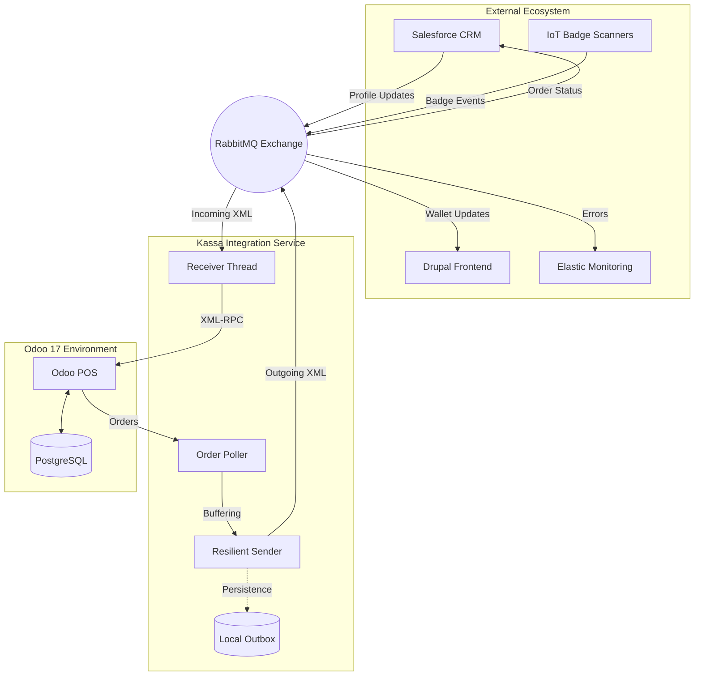

<div align="center">

<!-- Typing SVG Header -->


<br/>

<!-- Status & Tech Badges -->
[](https://github.com/IntegrationProject-Groep1/Kassa)
[](https://github.com/IntegrationProject-Groep1/Kassa/actions)
[](https://github.com/IntegrationProject-Groep1/Kassa/blob/dev/addons/kassa_pos_custom/__manifest__.py)
[](https://www.odoo.com)
[](https://www.rabbitmq.com)

<br/>

<!-- Skill Icons Grid -->
<a href="https://skillicons.dev">
  
</a>

</div>

---

## Overview

The **Kassa Integration** is the mission-critical communication bridge for Team POS at Desideriushogeschool 2026. It orchestrates high-integrity data flows between **Odoo 17** and external enterprise platforms including Salesforce CRM, Drupal, and IoT infrastructure.

Built on an event-driven architecture, it guarantees **100% message durability** through a sophisticated local buffering system, ensuring that retail operations never stop, even during network instability.

---

## Core Capabilities

- **Resilience**: Integrated `outbox.json` buffering system handles RabbitMQ downtime gracefully, with automated recovery and re-delivery.
- **IoT Integration**: Native Odoo 17 `bus` integration for real-time customer identification via physical badge scanners.
- **Compliance**: Automated logic for age-restricted products and validation of anonymous Badge Wallet transactions.
- **Performance Polling**: High-frequency order monitoring and immediate dispatching of consumption data to CRM systems.

---

## System Architecture

The integration service acts as a decoupled orchestrator between Odoo's synchronous API and the ecosystem's asynchronous messaging bus.



### Message Routing Details

The following table details all supported message types and their respective routing within the system.

| Message Type | Direction | Routing Key | Purpose |
| :--- | :--- | :--- | :--- |
| `new_registration` | **Incoming** (To POS) | `kassa.incoming` | Create or update customer profiles in Odoo from CRM. |
| `profile_update` | **Incoming** (To POS) | `kassa.incoming` | Update existing customer details (name, email, age, etc.). |
| `badge_scanned` | **Incoming** (To POS) | `kassa.incoming` | Trigger real-time profile loading in the POS UI via Odoo bus. |
| `cancel_registration` | **Incoming** (To POS) | `kassa.incoming` | Deactivate customer profiles in Odoo (soft delete). |
| `consumption_order` | **Outgoing** (From POS) | `kassa.payments.consumption` | Synchronize finalized transaction data with Salesforce. |
| `payment_registered` (Cons.) | **Outgoing** (From POS) | `kassa.payments.consumption` | Confirm payment for consumption orders in Salesforce. |
| `payment_registered` (Reg.) | **Outgoing** (From POS) | `kassa.payments.registration` | Confirm registration payment in Salesforce. |
| `invoice_request` | **Outgoing** (From POS) | `kassa.payments.invoice` | Request formal invoice generation in Salesforce. |
| `badge_assigned` | **Outgoing** (From POS) | `kassa.payments.badge` | Notify Salesforce of a new badge-to-customer link. |
| `refund_processed` | **Outgoing** (From POS) | `kassa.payments.refund` | Synchronize refund transactions with Salesforce. |
| `payment_status` | **Outgoing** (From POS) | `kassa.frontend.payment` | Update transaction status for the Drupal frontend. |
| `wallet_balance_update` | **Outgoing** (From POS) | `kassa.frontend.wallet` | Push real-time wallet balance changes to Drupal. |
| `heartbeat` | **Outgoing** (From POS) | `kassa.heartbeat` | System health pulse for monitoring. |
| `system_error` | **Outgoing** (From POS) | `kassa.errors` | Log operational and integration failures to Elastic. |

---

## Repository Structure

```text
📦 Kassa
 ┣ 📂 addons/                # Custom Odoo 17 modules (badge scanning, UI logic)
 ┣ 📂 integratie/            # Python integration service
 ┃ ┣ 📂 schemas/             # XML XSD validation schemas (14 definitions)
 ┃ ┣ 📂 tests/               # Pytest integration and unit suites
 ┃ ┣ 📂 tools/               # Diagnostic, simulation, and bootstrap tools
 ┃ ┣ 📜 main.py              # Service entrypoint — orchestrates threads
 ┃ ┣ 📜 receiver.py          # RabbitMQ consumer with idempotency logic
 ┃ ┣ 📜 sender.py            # Resilient message publisher with disk buffering
 ┃ ┗ 📜 order_poller.py      # Odoo 17 monitor for automated data extraction
 ┣ 📂 k8s/                   # Production Kubernetes deployment manifests
 ┣ 📜 docker-compose.yml     # Local development orchestration stack
 ┗ 📜 README.md
```

---

## Getting Started

### 1. Prerequisites
- **Docker & Docker Compose**
- **Python 3.12+**

### 2. Launch Development Stack
```bash
cp .env.example .env
docker-compose up -d
```

### 3. Verify Connection
Ensure the Python service can communicate with Odoo 17:
```bash
docker-compose exec kassa-integratie python tools/ping_odoo.py
```

---

## Team

| Role | Name |
| :--- | :--- |
| **Team Lead** | Jeremy Luyckfasseel |
| **Developer** | Ahmed Takadoumi |
| **Developer** | Zeno Van Neygen |

---

<div align="center">
  Official Repository - Team POS Integration Project 2026
</div>
