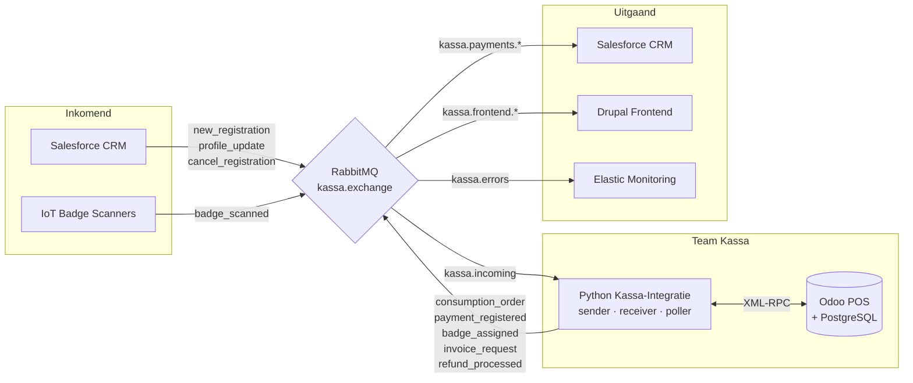

# Kassa Integratie — Odoo POS

> *Generiek herbruikbaar event-kassasysteem gebouwd op Odoo POS.*


> Officiële repository van Team Kassa voor het integratieproject Desideriushogeschool 2026.
> Dit project beheert het Point of Sale (POS) systeem en handelt de asynchrone communicatie af met CRM (Salesforce), de Frontend (Drupal), het monitoringsysteem (Elastic) en de IoT-badgescanners via RabbitMQ.

---

## 📋 Inhoudsopgave

- [Systeemarchitectuur](#systeemarchitectuur)
- [Berichtenflows & Routing](#berichtenflows--routing)
- [Documentatie & Datamapping](#documentatie--datamapping)
- [Lokale Ontwikkeling & Setup](#lokale-ontwikkeling--setup)
- [Repository Structuur](#repository-structuur)
- [CI/CD & Deployment](#cicd--deployment)
- [Teamrollen](#teamrollen)

---

## 🏗️ Systeemarchitectuur



De Python kassa-integratie container communiceert met Odoo uitsluitend via de ingebouwde XML-RPC API. Asynchrone communicatie met externe systemen verloopt uitsluitend via gestructureerde XML-berichten over RabbitMQ.

**Kernprincipes:**

- **Loosely Coupled:** Elk systeem kent andere systemen niet rechtstreeks — alles loopt via `kassa.exchange` (topic exchange).
- **Offline-first buffering:** Bij uitval van RabbitMQ worden berichten lokaal opgeslagen in `outbox.json` (Docker named volume `outbox-data`) en automatisch hersturd bij reconnect via `flush_buffer()`. De kassa blijft verkopen ook zonder netwerkverbinding.
- **Lokale Odoo-cache:** Bij uitval van het CRM werkt de kassa verder op lokaal gecachte klantprofielen in Odoo. Inkomende berichten worden pas verwerkt zodra de verbinding hersteld is.
- **Foutafhandeling:** Ongeldige berichten worden niet geretried maar afgevangen als `system_error` naar `kassa.errors`. Het originele bericht wordt vervolgens met `basic_nack(requeue=false)` afgewezen zodat het veilig in de Dead Letter Queue (DLQ) belandt voor analyse.
- **Heartbeats:** Worden afgehandeld door een aparte monitoring sidecar container — niet door de kassa-integratie zelf.

---

## 📨 Berichtenflows & Routing

### Inkomend (`kassa.incoming`)

| type | Van | Actie |
| :--- | :--- | :--- |
| `new_registration` | CRM | Klantprofiel aanmaken of updaten in Odoo |
| `profile_update` | CRM | Klantprofiel bijwerken in Odoo |
| `cancel_registration` | CRM | Klantprofiel deactiveren in Odoo |
| `badge_scanned` | IoT | Badge opzoeken, klantprofiel laden in POS |

### Uitgaand (`kassa.exchange`)

| type | Routing key | Naar |
| :--- | :--- | :--- |
| `consumption_order` | `kassa.payments.consumption` | Salesforce CRM |
| `payment_registered` | `kassa.payments.consumption` / `kassa.payments.registration` | Salesforce CRM |
| `invoice_request` | `kassa.payments.invoice` | Salesforce CRM |
| `badge_assigned` | `kassa.payments.badge` | Salesforce CRM |
| `refund_processed` | `kassa.payments.refund` | Salesforce CRM |
| `payment_status` | `kassa.frontend.payment` | Drupal |
| `wallet_balance_update` | `kassa.frontend.wallet` | Drupal |
| `system_error` | `kassa.errors` | Elastic |

> Het Controlroom-team kan passief meeluisteren op alle kassa-berichten via de wildcard binding `kassa.#`.

---

## 📚 Documentatie & Datamapping

Onze volledige architectuur, dataflows en XML-standaarden zijn gedocumenteerd in de `documentatie/` map:

| Bestand | Inhoud |
| :--- | :--- |
| [Technische_Gids_Kassa.md](documentatie/Technische_Gids_Kassa.md) | Volledige architectuur, alle scripts met codevoorbeelden, Docker setup, CI/CD |
| [Tech_Stack_Kassa.md](documentatie/Tech_Stack_Kassa.md) | Technologieën, Python-bibliotheken, environment variables, architectuurrestricties |
| [XML_Structuren_Kassa.md](documentatie/XML_Structuren_Kassa.md) | Exacte XML-voorbeelden en XSD-schema's per flow |
| [Datamapping_Kassa.md](documentatie/Datamapping_Kassa.md) | Veldmapping van Odoo naar XML per berichttype, enum-waarden |
| [User_Stories_Kassa.md](documentatie/User_Stories_Kassa.md) | MVP-features, BDD-scenario's, acceptatiecriteria, Definition of Done |
| [Vragen_Kassa.md](documentatie/Vragen_Kassa.md) | Beslissingslogboek — alle technische en functionele keuzes onderbouwd |

---

## 💻 Lokale Ontwikkeling & Setup

### Vereisten

- Docker & Docker Compose
- Git

### Opstarten

1. **Environment configureren:** Kopieer `.env.example` naar `.env` en vul de credentials in.

   ```bash
   cp .env.example .env
   ```

2. **Stack starten:**

   ```bash
   docker-compose up -d
   ```

3. **Connectietest:** Valideer de XML-RPC verbinding met Odoo:

   ```bash
   docker-compose exec kassa-integratie python tools/ping_odoo.py
   ```

   *Verwachte output:* `✅ Authenticatie geslaagd! Scripts kunnen data veilig wegschrijven.`

### Handige commando's

| Commando | Wat doet het? |
| :--- | :--- |
| `docker-compose up -d` | Start alle containers op de achtergrond |
| `docker-compose down` | Stop en verwijder alle containers |
| `docker-compose logs -f kassa-integratie` | Live logs van de integratie-container |
| `docker-compose logs -f odoo` | Live logs van Odoo |
| `docker-compose exec kassa-integratie bash` | Open een shell in de integratie-container |

### Scripts uitvoeren

```bash
docker-compose exec kassa-integratie python integratie/tools/test_sender.py
```

### ⚠️ Bekende valkuil — Odoo webassets 500 na herstart

Als Odoo POS na een container-herstart een 500-fout geeft op `/web/assets/...`, voer dan uit:

```bash
docker exec -i kassa_db psql -U odoo -d odoo_kassa -c "DELETE FROM ir_attachment WHERE url LIKE '/web/assets/%';"
docker-compose restart kassa-web
```

Zie §3.2.1 van de Technische Gids voor de volledige uitleg.

---

## 📁 Repository Structuur

```text
📦 Kassa-dev
 ┣ 📂 documentatie/          # Architectuur, mapping en flow documentatie
 ┣ 📂 integratie/            # Python integratiescripts
 ┃ ┣ 📂 schemas/             # XSD validatiebestanden
 ┃ ┣ 📂 tests/               # Pytest files
 ┃ ┣ 📂 tools/               # Ping- en diagnosescripts
 ┃ ┣ 📜 main.py              # Opstartbestand — start receiver + poller
 ┃ ┣ 📜 receiver.py          # Verwerkt inkomende RabbitMQ-berichten
 ┃ ┣ 📜 sender.py            # Bouwt en verstuurt uitgaande XML-berichten
 ┃ ┗ 📜 poller.py            # Pollt Odoo op nieuwe POS-orders, triggert flows
 ┣ 📂 outbox/                # Gemount als Docker volume — outbox.json buffer
 ┣ 📜 .env.example           # Voorbeeld environment variabelen
 ┣ 📜 docker-compose.yml     # Odoo + PostgreSQL + kassa-integratie stack
 ┗ 📜 README.md
```

---

## 🔄 CI/CD & Deployment

De GitHub Actions pipeline draait automatisch bij een push naar `dev` of `prod`:

| Stap | Trigger | Actie |
| :--- | :--- | :--- |
| **Tests** | push naar `dev` of `prod` | `pytest tests/ -v` |
| **Deploy** | push naar `prod` | SSH deploy naar server via `docker-compose up -d --build` |

### Branch strategie

| Branch | Waarvoor? |
| :--- | :--- |
| `main` | Stabiele, goedgekeurde code |
| `prod` | Productiecode — deploy trigger |
| `dev` | Actieve ontwikkeling |
| `feature/...` | Nieuwe functies |
| `fix/...` | Bugfixes |

---

## 👥 Team

| Rol | Naam |
| :--- | :--- |
| **Team Lead** | [naam] |
| **Developer** | [naam] |
| **Developer** | [naam] |
