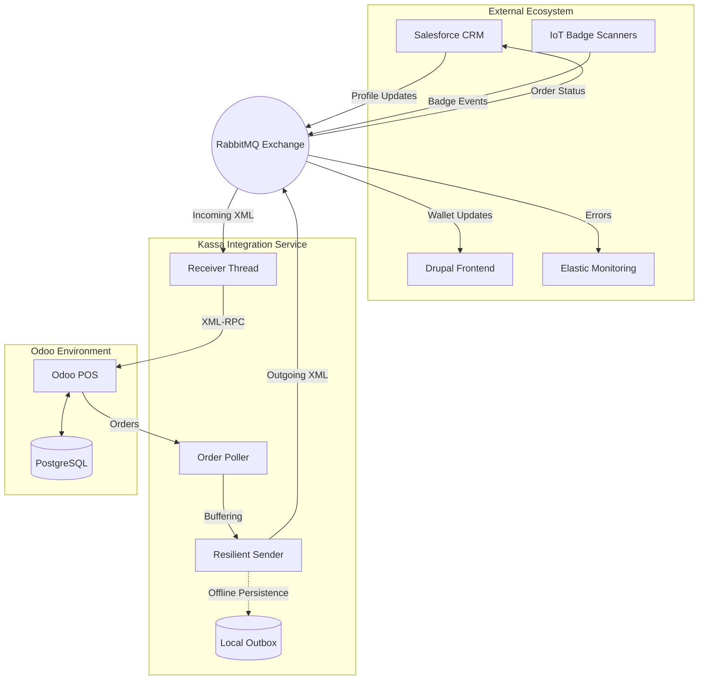

<div align="center">

<!-- Typing SVG Header -->


<br/>

<!-- Status & Tech Badges -->
[](https://github.com/IntegrationProject-Groep1/Kassa)
[](https://github.com/IntegrationProject-Groep1/Kassa/actions)
[](https://github.com/IntegrationProject-Groep1/Kassa/blob/dev/addons/kassa_pos_custom/__manifest__.py)
[](https://www.odoo.com)
[](https://www.rabbitmq.com)

</div>

---

## 📖 Project Overview

The **Kassa Integration** is a mission-critical bridge designed for the Desideriushogeschool 2026 event ecosystem. It serves as the primary data conduit between the **Odoo Point of Sale** and external enterprise systems, ensuring high availability and transactional integrity.

> *"Bridging the gap between real-time retail operations and asynchronous enterprise data flows."*

---

## ✨ Core Capabilities

| Feature | Description | Status |
|---|---|---|
| **🛡️ Resilience** | Local `outbox.json` buffering for 100% message delivery during network outages. | ✅ |
| **🆔 Smart Identity** | IoT Badge scanning via Odoo `bus` for instantaneous customer identification. | ✅ |
| **🔞 Compliance** | Automated logic for age-restricted products and anonymous transaction blocking. | ✅ |
| **🔄 Sync Engine** | High-frequency polling and real-time consumption order dispatching. | ✅ |

---

## 🛠️ Technical Stack

| Domain | Technologies |
|---|---|
| **Core Languages** |    |
| **Frameworks** |   |
| **Infrastructure** |    |
| **Architecture** |   |

---

## 🏗️ System Architecture

Our architecture is strictly decoupled. The integration service acts as the orchestrator, managing state between Odoo's synchronous API and the ecosystem's asynchronous messaging.



### 📋 Message Routing Legend

| Type | Direction | Target | Purpose |
| :--- | :---: | :--- | :--- |
| `new_registration` | 📥 | Odoo | Onboarding new customers from CRM. |
| `badge_scanned` | 📥 | POS | Instant UI profile loading. |
| `consumption_order`| 📤 | Salesforce | Finalizing transaction billing. |
| `system_error` | 📤 | Elastic | Real-time failure observability. |

---

## 📈 Integration Activity

<p align="center">
  
  
</p>

<p align="center">
  
</p>

---

## 🚀 Deployment & Usage

### Rapid Setup
```bash
cp .env.example .env
docker-compose up -d
```

### Diagnostics
```bash
# Check Odoo Connectivity
docker-compose exec kassa-integratie python tools/ping_odoo.py

# Simulate Integration Message
docker-compose exec kassa-integratie python tools/create_test_order.py
```

---

<div align="center">

*"Turning complex business requirements into seamless technical solutions."*

<br/>

[](https://www.linkedin.com/in/jeremy-luyckfasseel-97244a32b)
[](mailto:luyckfasseel.jeremy@gmail.com)

</div>
